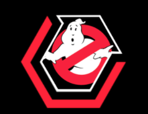

  

# DeepGhostBusters
Repository for the paper "DeepGhostBusters: Using Mask R-CNN to Detect and Mask Ghosting and Scattered-Light Artifacts from Optical Survey Images"\
Astronomy & Computing, submitted\
ArXiv: 

**Authors:**\
Dimitrios Tanoglidis, ...........

### Abstract 
Wide-field astronomical surveys are often plagued by the presence of reflected (often known as "ghosting artifacts" or, simply, "ghosts") and scattered-light artifacts. 
The identification and mitigation of these artifacts is crucial for rigorous astronomical analyses. 
However, the identification of ghosts and scattered-light artifacts is challenging given the complex morphology of these features and the large data volume of current and near-future surveys. 
In this work we use images from the Dark Energy Survey to train, validate, and test a Mask R-CNN model to detect and localize ghosts and scattered-light artifacts. 
We find that the ability of the Mask R-CNN model to mask affected regions is superior to that of conventional algorithms and classical CNN methods. 
We propose that a multi-step pipeline combining Mask R-CNN segmentation with a classical CNN classifier provides a powerful technique for the automated detection of ghosting and scattered-light artifacts in current and near-future surveys.

---

### Table of contents

- [Mask R-CNN](#Mask-R-CNN-implementation)

---
### Mask R-CNN implementation

