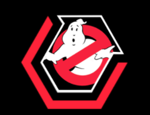
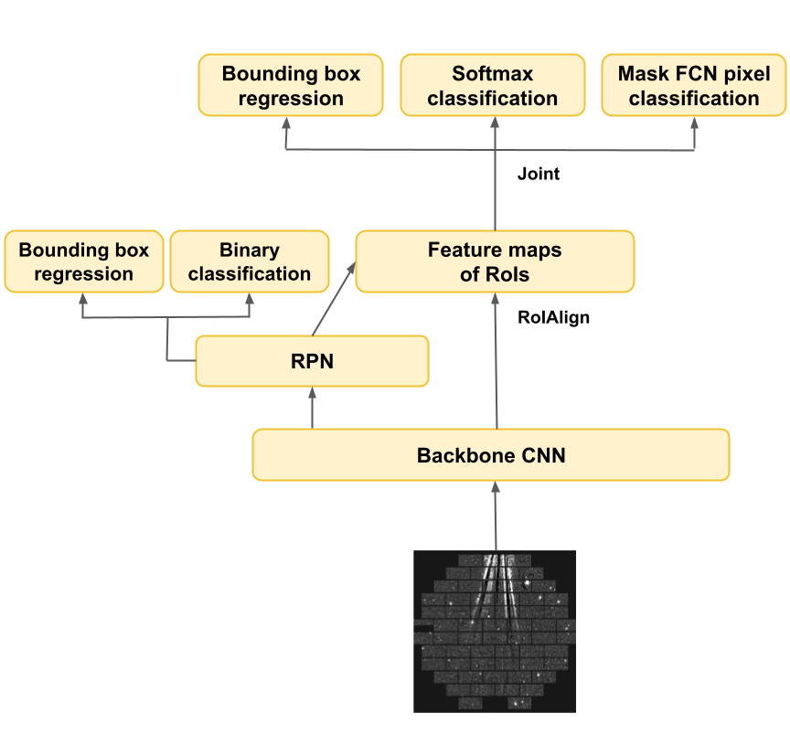

# DeepGhostBusters

  

Repository for the paper "DeepGhostBusters: Using Mask R-CNN to Detect and Mask Ghosting and Scattered-Light Artifacts from Optical Survey Images"\
Astronomy & Computing, published\
ArXiv: arXiv:2109.08246

**Authors:**\
Dimitrios Tanoglidis, Aleksandra Ćiprijanović, Alex Drlica-Wagner, Brian Nord, Michael H.L.S. Wang, Ariel Jacob Amsellem, Kathryn Downey, Sydney Jenkins, Diana Kafkes, Zhuoqi Zhang

### Abstract 
Wide-field astronomical surveys are often affected by the presence of undesirable reflections (often known as ''ghosting artifacts'' or ''ghosts") and scattered-light artifacts. 
The identification and mitigation of these artifacts is important for rigorous astronomical analyses of faint and  low-surface-brightness systems. 
However, the identification of ghosts and scattered-light artifacts is challenging due to a) the complex morphology of these features and b) the large data volume of current and near-future surveys. 
In this work, we use images from the Dark Energy Survey (DES) to train, validate, and test a deep neural network (Mask R-CNN) to detect and localize ghosts and scattered-light artifacts. 
We find that the ability of the Mask R-CNN model to identify affected regions is superior to that of conventional algorithms and traditional convolutional neural networks methods. 
We propose that a multi-step pipeline combining Mask R-CNN segmentation with a classical CNN classifier provides a powerful technique for the automated detection of ghosting and scattered-light artifacts in current and near-future surveys.

---

### Table of contents

- [Mask R-CNN](#Mask-R-CNN-implementation)
- [Datasets](#Datasets)
- [Training](#Training)
- [Inference](#Inference-&-Evaluation)
- [Notebook descriptions](#Notebook-descriptions)
- [Requirements](#Requirements)

---
### Mask R-CNN implementation

  

[Mask R-CNN](https://arxiv.org/abs/1703.06870) is a state-of-the art instance segmentation algorithm developed by Facebook's AI Research team ([FAIR](https://ai.facebook.com/)).

In this work we use the Mask R-CNN implementation developed by [Matterport](https://github.com/matterport/Mask_RCNN) on Python 3, Keras, and TensorFlow.

Mask R-CNN simultaneously performs object detection and semantic segementation; the figure above presents a high-level description of its architecture: A pre-trained backbone CNN network is used to generate feature maps, that pass through a Region Proposal Network (RPN) that finds (bounding box coordinates) a number of Regions of Interest (RoIs) that are likely to contain an object. Subsequently the feature maps of these RoIs are being sent to the main part of Mask R-CNN that simultaneously performs: 
- Regression of box coordinates, to find the optimal bounding box around each object.
- Classification, to find the category of each object.
- Per-pixel-classification, using Fully Convolutional CNNs ([FCN](https://arxiv.org/abs/1411.4038)) to create the segmentation masks.

For a more detailed, pedagogical, description of the Mask R-CNN model and its precursors, see [Weng 2017](https://lilianweng.github.io/lil-log/2017/12/31/object-recognition-for-dummies-part-3.html).

---
### Datasets

  
   

Training the Mask R-CNN algorithm requires a number of images and and ground truth **segmentation masks** identifying objects of interest in each image.

We use 2000,  400x400 pixel, ghost- and scattered-light-containing focal plane images, coming from the full six years of operations of the Dark Energy Survey ([DES](https://www.darkenergysurvey.org/)). 
These come from the training set used in [Chang et al., 2021](https://arxiv.org/abs/2105.10524) to train a standard CNN to distinguish clean from ghost-containing images, and are publicly available [here](https://des.ncsa.illinois.edu/releases/other/paper-data).

The masks were manually generated by eight of the authors of the present work, using the VGG Image Annotator ([VGG](https://www.robots.ox.ac.uk/~vgg/software/via/)). The annotatios are provided as `json` files containing, for each image, the coordinates of the manually created masks. During the annotation process we use classify each artifact into one of the three morphological categories `Bright`, `Faint`, `Rays`, as described in the paper. 
An example of an artifact-containing image (left) with the corresponding masks (right) is shown above (these artifacts are of the type `Rays`).

Before training, we randomly split the full dataset (images and corresponding masks) into a training set (1400 images), a validation set (300 images), and a test set (300 images), as shown in the notebook [Dataset_Split.ipynb](/Datasets/Dataset_Split.ipynb).

Inside the [Datasets](/Datasets) folder you can find as `zip` files the three sets:

- `Training_set_1.zip`, `Training_set_1.zip`,  `Training_set_3.zip`. These files, combined, constitute the training set (images only). Ww split the training set into thtree files here, because the full dataset was too large to be uploaded as a single file.
- `Validation_set.zip`, for the images in the validation set.
- `Test_set.zip`, for the images in the test set.

All the annotation (masks and classes) `json` files can be found in the folder [Annotations](/Datasets/Annotations). Specifically, we provide both the annotation files generated by each one of us (`Name_i.json`, i=1,2,3,4) as well as:

- `annotations_train.json`, for the training set.
- `annotations_val.json`, for the validation set.
- `annotations_test.json`, for the test set.

In the [Common_Core](/Datasets/Common_Core) folder, within the [Datasets](/Datasets) folder, we have a set of 50 images (`Common_core.zip`) and annotation files generated, for this common set of images, by each one of the annotators (`common_core_{name}.json`). These were used in the [Annotators_Comparison.ipynb](/Annotators_Comparison.ipynb) notebook to assess the agreement between the masks generated by the different annotator, by producing, for example, figures like the one below:

  

In cases where we wanted to compare with the results of the **Ray-Tracing algorithm** that is currently used by DES to identify ghost-containing CCDs in focal plane images, we used the files available [here](https://des-ops.fnal.gov:8082/exclude/) (`Ghost images` files, containing exposure numbers `expnum` and affected CCD numbers, `ccdnum`).

---
### Training

  

The training of the *DeepGhostBusters* Mask R-CNN model is performed in the [Training_Ghosts.ipynb](/Training_Ghosts.ipynb) notebook.

We define the `class GhostsDataset` that loads the datasets (training, validation) -- images and annotations -- in a form that the above Mask R-CNN implementation is able to process. This, in turn, was adapted from the `class BalloonDataset` [here](https://github.com/matterport/Mask_RCNN/blob/master/samples/balloon/balloon.py), an example provided by the developers of the Mask R-CNN code we use. 

The configuration class `class GhostsConfig(Config)` has also been edited to accept `Type` as the name of the different artifact classes in our annotation files, and we have also defined initial learning rate, batch size etc.

The backbone network we used is the [Resnet-101](https://arxiv.org/abs/1512.03385) pretrained (weight initialization) on the [COCO dataset](https://cocodataset.org/#home).

We trained the Mask R-CNN model for 75 epochs with progressively decreasing learning rate, as described in the paper. The total loss as a function of training epoch is shown in the figure above. Training took ~4 hours on Colab Pro's fast GPUs.

In the notebook we show how to store the training history, make plots of the different components of the loss etc.

---
### Inference & Evaluation

In [Inference_and_Evaluation.ipynb](/Inference_and_Evaluation.ipynb) we evaluate the performance of the Mask R-CNN model on the test set (described in the [Datasets](#Datasets)); it is the notebook used to generate all the results presented in the main `Results` section of our paper (and of the related appendices).

It is broadly divided in four parts:

- In the first part we present some examples of predicted ghosting and scattered-light artifact masks, like the one below (different colors corresponding to different artifact classes):

  

- In the second part we define CCD-based metrics (precision, recall, F1 score) and we compare the results from the Mask R-CNN and Ray-Tracing algorithms, in plots like the one shown below:

  

- In the third part we estimate some evaluation metrics, such as the Average Precision (AP) at different overlap (between predicted and ground truth masks) levels, that are common in the object detection literature. These can be used to compare the performance of the algorithm in detecting and masking effectively of different artifact types. Precision-Recall curves at different overlap levels and for the different artifact types are shown below:

  

- In the final part we test the ability of the Mask R-CNN to distinguish between images that contain ghosts or scattered-light artifacts and images that are "clean". For this reason we used the original test set from [Chang et al., 2021](https://arxiv.org/abs/2105.10524), available [here](https://des.ncsa.illinois.edu/releases/other/paper-data), that contains an even number of ghost-containing and clean images (1792 in total). We assigned a label "has ghost" to each image that the Mask R-CNN model found at least one artifact. The resulting confusion matrix can be seen below:

  
</p

  
---
  
### Notebook descriptions

The content of most of the notebooks in this repository has already been described above, but let us give a brief summary for ease of reference (also describing a couple of other Python scripts in this repository):

- [Training_Ghosts.ipynb](/Training_Ghosts.ipynb). The training process is performed; classes are provided to read the data files; plots of the training history are created.
- [Inference_and_Evaluation.ipynb](/Inference_and_Evaluation.ipynb). In this long notebook there are some object detection examples on unseen test images, estimation of evaluation metrics and a comparison with the results from the Ray-Tracing algorithm.
- [Annotators_Comparison.ipynb](/Annotators_Comparison.ipynb). In this notebook we study the cohesion of the annotation process by comparing the masks created by the eight different annotators on a common dataset of 50 images.
- [Mask_Reading.ipynb](/Mask_Reading.ipynb) shows how to read the annotation files and overplot the ground truth masks on the ghost-containing images. It also show how to map ghost-containing CCDs.
- [Data_gen.ipynb](/Data_gen.ipynb), converts the numpy files provided by [Chang et al., 2021](https://arxiv.org/abs/2105.10524) to `jpg` images; also shows a bit how to use the [run.py](/run.py) file (see below).
- [Dataset_Split.ipynb](/Datasets/Dataset_Split.ipynb) shows how we split the full dataset into training-validation-test sets.
- [Ghost_load.py](/Ghost_load.py) is a small script containing the `class GhostsDataset` described in the [Training](#Training) section, in case someone wants to use to load datasets in a different notebook (it is used in the Inference and evaluation notebook to load the test set).
- [run.py](/run.py) is a small script used to find the pixel coordinates of the CCD edges (useful when wanted to map ground truth or predicted artifact masks to the corresponding CCDs).

---
### Requirements

We ran all of our experiments in Google Colab Pro, using GPUs and High-RAM mode.

